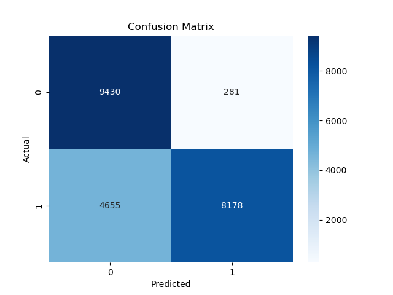
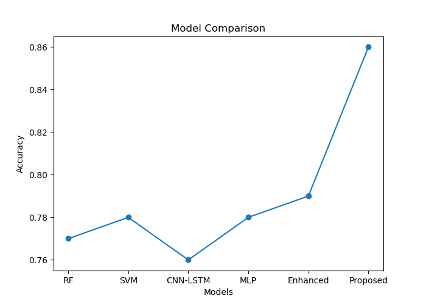

# Intelligent Intrusion Detection System for DDoS Attacks

This project presents a machine learning and deep learning-based intrusion detection system for identifying Distributed Denial of Service (DDoS) attacks using the NSL-KDD dataset.

The objective is to design an efficient and scalable model capable of detecting malicious network traffic while maintaining computational efficiency.

---

## 📌 Key Features

- Data preprocessing and feature engineering
- Dimensionality reduction using PCA
- Multiple baseline models (Random Forest, SVM)
- Deep learning models (CNN-LSTM, MLP)
- Enhanced model with Z-score normalization and class balancing
- Performance comparison across models

---

## 🧠 Methodology

The system follows a structured pipeline:

1. Data Loading and Cleaning  
2. Preprocessing and Encoding  
3. Dimensionality Reduction (PCA)  
4. Baseline Model Training  
5. Deep Learning Model Training  
6. Model Evaluation and Comparison  
7. Final Model Optimization  

---

## ⚙️ Phase-wise Implementation

### 🔹 Phase 1: Data Loading
- Loaded NSL-KDD dataset
- Inspected structure and label distribution

---

### 🔹 Phase 2: Data Preprocessing
- Removed unnecessary columns
- Encoded categorical features
- Converted labels into binary classification (Normal vs Attack)

---

### 🔹 Phase 3: Dimensionality Reduction
- Applied Principal Component Analysis (PCA)
- Reduced feature space while retaining ~99% variance

---

### 🔹 Phase 4: Baseline Models
- Random Forest
- Support Vector Machine (SVM)

These models provided a baseline performance for comparison.

---

### 🔹 Phase 5: CNN-LSTM Model
- Combined convolutional layers with LSTM
- Attempted to capture spatial + sequential patterns

---

### 🔹 Phase 6: Evaluation
- Accuracy, Precision, Recall, F1-score
- Confusion matrix analysis

---

### 🔹 Phase 7: MLP Model
- Simple feedforward neural network
- Provided stable and efficient performance

---

### 🔹 Phase 8: Raw Feature MLP
- Trained directly on raw features (without PCA)
- Compared impact of dimensionality reduction

---

### 🔹 Phase 9: Multiclass Experiment
- Attempted multi-class classification
- Explored fine-grained attack categorization

---

### 🔹 Phase 10: Enhanced Model
- Z-score normalization (StandardScaler)
- Class imbalance handling (weighted loss)
- Improved neural network architecture

---

## 📊 Results & Comparison

| Model | Accuracy |
|------|---------|
| Random Forest | 77% |
| SVM | 78% |
| CNN-LSTM | ~76% |
| MLP | ~78% |
| Enhanced MLP | 79% |
| **Proposed Model** | **86%** |

---

## 📈 Confusion Matrix



---

## 📉 Model Comparison



---

## 🧾 Final Observations

- Deep learning models outperform traditional ML models
- Proper preprocessing plays a critical role
- Increased complexity does not always guarantee better performance
- The proposed model achieves a strong balance between performance and simplicity

---

## 📁 Project Structure
```
DDoS-Intrusion-Detection-Hybrid-Model/
│
├── src/ # Source code (all phases)
├── notebooks/ # Demo notebook
├── results/ # Outputs, plots, metrics
├── data/ # Dataset (not included)
├── models/ # Saved models (not included)
├── README.md
```
---

## 📂 Dataset

Dataset used: **NSL-KDD**

Download from:
https://www.unb.ca/cic/datasets/nsl.html

Place the following files in the `data/` folder:
- KDDTrain+.txt
- KDDTest+.txt

---

## 🚀 How to Run

1. Install dependencies:
pip install -r requirements.txt


2. Run any phase:

python src/phase4_baselines.py
python src/phase5_cnn_lstm.py
python src/phase10_final_model.py


3. Open notebook:

notebooks/demo.ipynb

---

## 🧠 Future Work

- Advanced hybrid architectures (TCN, Attention)
- Real-time intrusion detection system
- Deployment using APIs
- Integration with IoT systems

---

## 📌 Conclusion

This project demonstrates that a well-structured pipeline with appropriate preprocessing and model selection can effectively detect DDoS attacks. The proposed approach achieves strong performance while maintaining simplicity and efficiency.

---

## 👨‍💻 Author

Developed as part of an academic project in Machine Learning / Cybersecurity.
